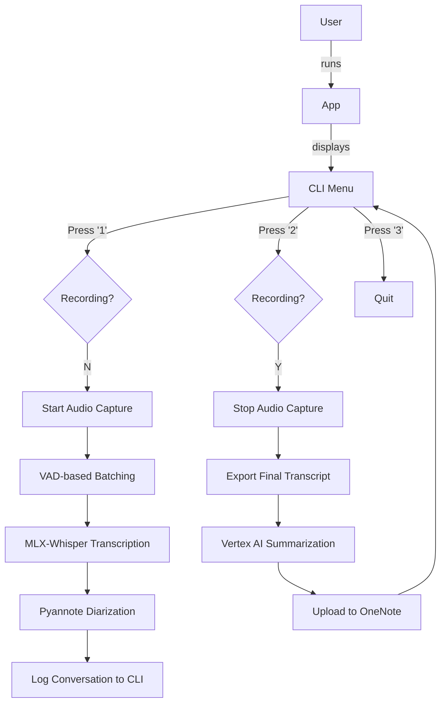

# You Talk Too Much App 🎙️

Feeling like you can't keep up with all the meeting discussions lately? This app records, transcribes, and summarizes your conversations using state-of-the-art ML models, then automatically syncs the summary to your Microsoft OneNote.

## Features

- ⚡ **Local High-Performance Transcription**: Uses `mlx-whisper` optimized for Apple Silicon.
- 👥 **Speaker Diarization**: Identifies who said what using `pyannote-audio` 4.x.
- 🔍 **Global Speaker Tracking**: Tracks speakers across different segments within a session using embedding similarity.
- 🧠 **AI-Powered Summarization**: Generates professional meeting notes, executive summaries, and action items via Vertex AI (Gemini).
- 📓 **OneNote Integration**: Automatically creates a new page in your specified OneNote section with the formatted summary.
- 💻 **Clean CLI Interface**: Real-time conversation logging with proper speaker labels and alignment.

## Tech Stack

- **Transcription**: `mlx-whisper`
- **Diarization**: `pyannote-audio` (v4.0.4+)
- **LLM**: Google Vertex AI (Gemini 2.5 Flash)
- **Audio**: `sounddevice` & `silero-vad`
- **Dependency Management**: `uv`

## Prerequisites

1. **Hardware**: Apple Silicon Mac (M1/M2/M3) is highly recommended for `mlx` performance.
2. **System Libraries**: Install `portaudio` via Homebrew:
   ```bash
   brew install portaudio
   ```
3. **API Access**:
   - **Hugging Face**: A token with access to `pyannote/speaker-diarization-community-1`.
   - **Google Cloud**: A Vertex AI project and a service account key JSON file.
   - **Microsoft Azure**: An App Registration for OneNote API access (Notes.ReadWrite.All).

## Installation

1. Install dependencies using `uv`:
   ```bash
   uv sync
   ```

2. Set up your environment variables by copying `.env.sample` to `.env` and filling in your details:
   ```bash
   cp .env.sample .env
   ```

## Usage

### Run via Command Line
```bash
uv run you-talk-too-much
```

### Run via AppleScript App
Under the [applescript/](applescript) folder, you can use the bundled `.app` file to launch the application in a dedicated iTerm window.

### Menu Options
1. **Start new capture**: Begins recording audio and processing it in real-time batches.
2. **Stop existing capture**: Finalizes the current session, generates the summary, and uploads it to OneNote.
3. **Quit program**: Exits the application.

## How it Works



## License
MIT
