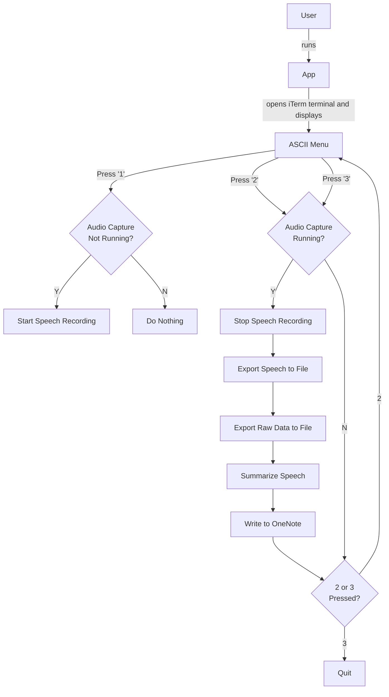

# You Talk Too Much App

Feeling like you can't keep up with all the meeting discussions lately? There's an app for that. 

This app will record the conversation, summarize it, and write it to OneNote.

# Getting Started

1. On Mac, install portaudio via brew. See https://stackoverflow.com/questions/33513522/when-installing-pyaudio-pip-cannot-find-portaudio-h-in-usr-local-include
2. Clone the repo.
3. Under [applescript/](applescript/) folder, use the app file to run the app.
4. ???
5. Profit.

# How does it Work

