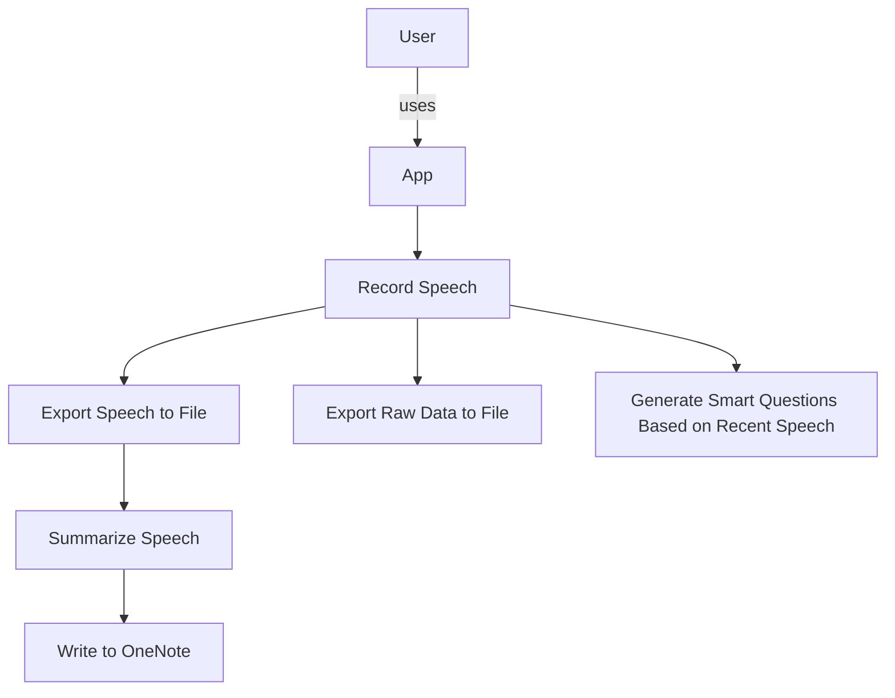

# you-talk-too-much-app

# Getting Started

On Mac, install portaudio via brew. See https://stackoverflow.com/questions/33513522/when-installing-pyaudio-pip-cannot-find-portaudio-h-in-usr-local-include
